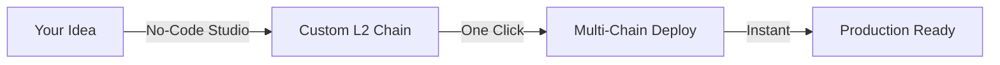
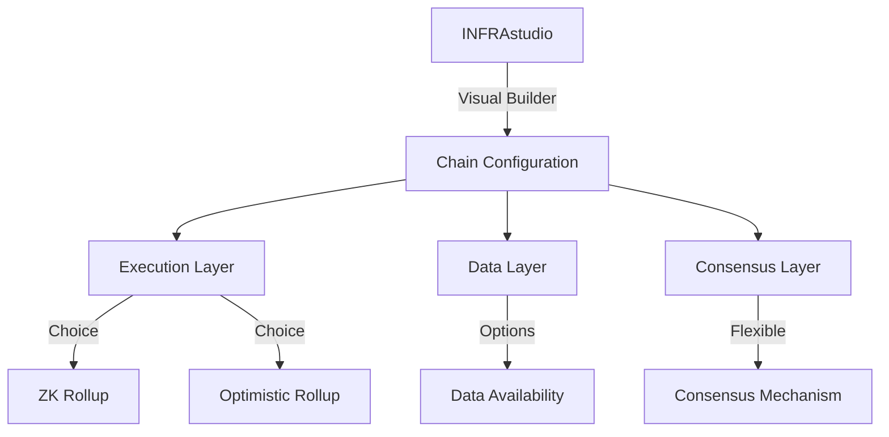

# 🏗️ INFRASTRUKT

<div align="center">


**The No-Code Layer 2 Infrastructure Incubator On Solana**

[](https://twitter.com/infrastrukt)
[](LICENSE)

</div>

## 🚀 Welcome to the Future of Blockchain Infrastructure

INFRASTRUKT is revolutionizing blockchain development by enabling **anyone** to deploy production-ready Layer 2 chains across any network with just a few clicks. Think of it as your blockchain infrastructure superpower – where complex tech meets drag-and-drop simplicity.

### ✨ Why INFRASTRUKT?



- 🎯 **Deploy in Minutes**: Launch your L2 chain faster than brewing your morning coffee
- 🌐 **Chain-Agnostic**: Works seamlessly with Solana, Ethereum, Binance, and more
- 🔒 **Military-Grade Security**: Built-in ZK privacy and shared security pool
- 🤝 **Cross-Chain Ready**: Native interoperability that just works
- 🎮 **No-Code Interface**: Drag, drop, deploy – it's that simple

## 🎮 Quick Start

```typescript
import { Chain } from '@infrastrukt/sdk';

// Create your L2 in 3 lines
const chain = new Chain({
  name: 'MyAwesomeL2',
  baseChain: 'Ethereum',
  executionLayer: 'ZK',
  tps: 50000,
  features: {
    privacy: true,
    interop: true
  }
});

// Deploy with one command
await chain.deploy();
```

## 🌟 Core Features

| Category | Features | Description |
|----------|----------|-------------|
| 🏗️ **Architecture** | Multi-Chain Support | Deploy on any major blockchain |
| | Modular Components | Mix and match execution environments |
| | Scalable Design | Handle millions of transactions |
| 🛡️ **Security** | ZK Privacy | Optional anonymity for transactions |
| | Shared Security | Leverage cross-chain validator networks |
| | Fraud Proofs | Automatic state verification |
| 🔄 **Interop** | Native Bridges | Seamless cross-chain communication |
| | Atomic Swaps | Cross-chain transactions in one click |
| | Universal Messages | Chain-agnostic messaging protocol |
| 🎨 **Development** | No-Code Studio | Visual chain builder interface |
| | SDK Support | TypeScript, Python, and Rust SDKs |
| | Templates | Pre-built solutions for common use cases |

## 💡 Use Cases

### DeFi Superhighway
```typescript
// Create a cross-chain DeFi hub
const defiChain = new Chain({
  name: 'DeFiHub',
  features: {
    interop: true,
    liquidityAggregation: true
  }
});
```

### Private Social Networks
```typescript
// Launch a privacy-first social platform
const socialChain = new Chain({
  name: 'PrivateSocial',
  features: {
    privacy: true,
    storage: 'decentralized'
  }
});
```

### Gaming Universes
```typescript
// Build a high-performance gaming chain
const gameChain = new Chain({
  name: 'GameVerse',
  tps: 100000,
  features: {
    assets: true,
    lowLatency: true
  }
});
```

## 🛠️ Development Stack



## 🏃‍♂️ Getting Started

1. **Install the SDK**
   ```bash
   npm install @infrastrukt/sdk
   ```

2. **Configure Your Chain**
   ```typescript
   const config = {
     name: 'MyL2Chain',
     baseChain: 'Ethereum',
     features: {
       privacy: true,
       interop: true
     }
   };
   ```

3. **Deploy**
   ```typescript
   const chain = new Chain(config);
   await chain.deploy();
   ```

## 📚 Resources

- [📖 Technical Documentation](./docs/INFRASTRUKT-technical-documentation.md)
- [🎓 Tutorial Series](https://docs.infrastrukt.dev/tutorials)
- [🎨 INFRAstudio Guide](https://docs.infrastrukt.dev/studio)
- [🤝 Contributing Guide](CONTRIBUTING.md)

## 🗺️ Roadmap

| Quarter | Milestone | Status |
|---------|-----------|---------|
| Q4 2023 | Testnet Launch | 🟡 In Progress |
| Q1 2024 | Cross-Chain Mining | 🔵 Planned |
| Q2 2024 | InfraDAO Launch | 🔵 Planned |
| Q3 2024 | Mainnet Release | 🔵 Planned |

## 🤝 Community

- [Twitter](https://twitter.com/infrastrukt) - Follow for updates

## 🔐 Security

INFRASTRUKT takes security seriously. See our [security policy](SECURITY.md) for details.

- 🛡️ Regular audits
- 🔍 Bug bounty program
- 🔒 Responsible disclosure policy

## 📜 License

INFRASTRUKT is released under the MIT License. See the [LICENSE](LICENSE) file for details.

---

<div align="center">

**Built with ❤️ by [INFRA Labs](https://infralabs.dev)**

[Website](https://infrastrukt.dev) • [Documentation](https://docs.infrastrukt.dev) • [GitHub](https://github.com/infrastrukt)

</div># INFRAstudio
