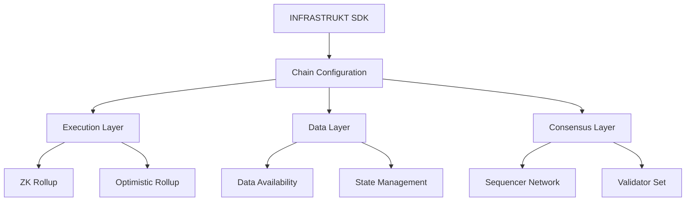

# INFRASTRUKT Technical Documentation

## Table of Contents

1. [Architecture Overview](#architecture-overview)
2. [Core Components](#core-components)
3. [Chain Configuration](#chain-configuration)
4. [Execution Environments](#execution-environments)
5. [Cross-Chain Communication](#cross-chain-communication)
6. [Security Model](#security-model)
7. [SDK Reference](#sdk-reference)
8. [Advanced Topics](#advanced-topics)

## Architecture Overview

INFRASTRUKT is a modular Layer 2 (L2) development platform that enables the creation and deployment of customizable blockchain solutions. The architecture is designed around three core principles:

1. **Modularity**: Each component is independent and interchangeable
2. **Flexibility**: Support for multiple execution environments and base chains
3. **Interoperability**: Native cross-chain communication capabilities

The platform's architecture represents a significant advancement in blockchain infrastructure, allowing developers to mix and match components while maintaining security and performance. This approach differs from traditional monolithic L2 solutions by decomposing the stack into distinct, interoperable layers.

### High-Level Architecture



### Component Interaction

The INFRASTRUKT architecture facilitates seamless interaction between components through a standardized messaging protocol. This enables:

- Dynamic component replacement without system downtime
- Cross-layer optimization opportunities
- Unified monitoring and debugging interfaces

## Core Components

### Chain Manager

The Chain Manager is the central orchestration component responsible for coordinating all aspects of L2 chain deployment and operation. It implements sophisticated state management and lifecycle control mechanisms.

Key responsibilities include:

- Chain lifecycle management
- Configuration validation
- State synchronization
- Resource allocation
- Performance monitoring
- Fault detection and recovery

```typescript
interface ChainStatus {
  status: 'active' | 'inactive' | 'deploying' | 'error';
  blockHeight: number;
  tps: number;
  latency: number;
  uptime: number;
}

class Chain {
  private config: ChainConfig;
  private status: ChainStatus;
  private metrics: MetricsCollector;
  private stateManager: StateManager;

  constructor(config: ChainConfig) {
    this.config = config;
    this.metrics = new MetricsCollector();
    this.stateManager = new StateManager();
    this.status = this.initializeStatus();
  }

  async deploy(options: DeploymentOptions): Promise<void> {
    await this.validateResources();
    await this.initializeComponents();
    await this.startServices();
    await this.verifyDeployment();
  }

  async getStatus(): Promise<ChainStatus> {
    return this.status;
  }

  private async validateResources(): Promise<void> {
    // Resource validation logic
  }

  private async initializeComponents(): Promise<void> {
    // Component initialization logic
  }
}
```

### Sequencer Network

The Sequencer Network is a critical component that ensures transaction ordering and efficient batch processing. It implements advanced algorithms for optimal transaction batching and cross-chain synchronization.

```typescript
class Sequencer {
  private chain: BaseChain;
  private provider: ethers.Provider;
  private queue: Transaction[] = [];
  private batchSize: number;
  private maxLatency: number;

  constructor(
    chain: BaseChain, 
    provider: ethers.Provider,
    config: SequencerConfig
  ) {
    this.chain = chain;
    this.provider = provider;
    this.batchSize = config.batchSize;
    this.maxLatency = config.maxLatency;
  }

  async submitTransaction(tx: Transaction): Promise<string> {
    await this.validateTransaction(tx);
    this.queue.push(tx);
    
    if (this.shouldProcessBatch()) {
      return this.processBatch();
    }
    
    return this.queueTransaction(tx);
  }

  private shouldProcessBatch(): boolean {
    return this.queue.length >= this.batchSize || 
           this.getOldestTxAge() > this.maxLatency;
  }

  private async processBatch(): Promise<string> {
    const batch = this.prepareBatch();
    const proof = await this.generateBatchProof(batch);
    return this.submitBatchToL1(batch, proof);
  }

  private async generateBatchProof(batch: Transaction[]): Promise<Proof> {
    // Proof generation logic
    return proof;
  }
}

interface SequencerConfig {
  batchSize: number;
  maxLatency: number;
  proofType: 'zk' | 'fraud';
  optimisticPeriod?: number;
}
```

## Chain Configuration

### Configuration Schema

INFRASTRUKT employs a sophisticated configuration system that ensures type safety and validation at every level. The system uses TypeScript for compile-time checking and Zod for runtime validation.

```typescript
interface ChainConfig {
  name: string;
  executionLayer: 'ZK' | 'Optimistic';
  baseChain: 'Ethereum' | 'Solana' | 'Binance';
  sequencer: 'Decentralized' | 'Centralized' | 'Hybrid';
  tps: number;
  features: {
    privacy: boolean;
    interop: boolean;
    dataAvailability: boolean;
  };
  consensus: {
    algorithm: string;
    blockTime: number;
    validators: number;
  };
  scaling: {
    shards: number;
    maxTxPerShard: number;
    shardingAlgorithm: 'static' | 'dynamic';
  };
  security: {
    minStake: bigint;
    slashingPenalty: number;
    challengePeriod: number;
  };
}
```

### Validation System

The validation system ensures configuration integrity through multiple layers:

```typescript
const chainConfigSchema = z.object({
  name: z.string().min(1).max(50),
  executionLayer: z.enum(['ZK', 'Optimistic']),
  baseChain: z.enum(['Ethereum', 'Solana', 'Binance']),
  sequencer: z.enum(['Decentralized', 'Centralized', 'Hybrid']),
  tps: z.number().min(1000).max(100000),
  features: z.object({
    privacy: z.boolean(),
    interop: z.boolean(),
    dataAvailability: z.boolean(),
  }),
  consensus: z.object({
    algorithm: z.string(),
    blockTime: z.number().min(0.1).max(60),
    validators: z.number().min(1).max(1000),
  }),
  scaling: z.object({
    shards: z.number().min(1).max(256),
    maxTxPerShard: z.number().min(100).max(10000),
    shardingAlgorithm: z.enum(['static', 'dynamic']),
  }),
  security: z.object({
    minStake: z.bigint().min(BigInt(1000)),
    slashingPenalty: z.number().min(0).max(100),
    challengePeriod: z.number().min(60).max(604800),
  }),
});

class ConfigValidator {
  static async validate(config: ChainConfig): Promise<ValidationResult> {
    try {
      await this.validateBasicSchema(config);
      await this.validateConsistency(config);
      await this.validateResources(config);
      await this.validateSecurity(config);
      return { valid: true };
    } catch (error) {
      return { valid: false, errors: this.formatErrors(error) };
    }
  }

  private static async validateConsistency(config: ChainConfig): Promise<void> {
    // Ensure configuration parameters are mutually compatible
  }

  private static async validateResources(config: ChainConfig): Promise<void> {
    // Verify required computational resources are available
  }
}
```

## Execution Environments

### ZK Rollups

INFRASTRUKT's ZK rollup implementation leverages cutting-edge zero-knowledge proof systems to achieve high throughput while maintaining security. The system supports multiple proving schemes and automatically selects the most efficient one based on the use case.

Key components:

1. **Proof Generation Pipeline**
```typescript
interface ProofGenerationConfig {
  scheme: 'PLONK' | 'Groth16';
  curve: 'BN254' | 'BLS12-381';
  batchSize: number;
  parallelism: number;
}

class ProofGenerator {
  private config: ProofGenerationConfig;
  private prover: Prover;
  private circuit: Circuit;

  constructor(config: ProofGenerationConfig) {
    this.config = config;
    this.prover = this.initializeProver();
    this.circuit = this.compileCircuit();
  }

  async generateProof(input: CircuitInput): Promise<ZKProof> {
    const witness = await this.generateWitness(input);
    const proof = await this.prover.prove(witness);
    return this.optimizeProof(proof);
  }

  private async optimizeProof(proof: ZKProof): Promise<ZKProof> {
    // Proof optimization logic
    return optimizedProof;
  }
}
```

2. **Circuit Optimization**
```typescript
class CircuitOptimizer {
  private constraints: Constraint[];
  private gates: Gate[];

  async optimize(): Promise<Circuit> {
    await this.removeRedundantConstraints();
    await this.mergeGates();
    await this.balanceConstraints();
    return this.generateOptimizedCircuit();
  }

  private async balanceConstraints(): Promise<void> {
    // Constraint balancing logic
  }
}
```

### Optimistic Rollups

The Optimistic rollup implementation provides a sophisticated fraud proof system with automatic verification and challenge management.

```typescript
class FraudProofSystem {
  private chain: Chain;
  private verifier: StateVerifier;
  private challengePeriod: number;

  async submitChallenge(proof: FraudProof): Promise<ChallengeResult> {
    await this.validateChallenge(proof);
    const result = await this.verifyFraudProof(proof);
    return this.processChallengeResult(result);
  }

  private async verifyFraudProof(proof: FraudProof): Promise<VerificationResult> {
    const stateTransition = await this.reconstructStateTransition(proof);
    return this.verifier.verifyTransition(stateTransition);
  }
}

interface FraudProof {
  blockNumber: number;
  preState: StateRoot;
  postState: StateRoot;
  invalidTransition: StateTransition;
  witness: Witness;
}
```

## Cross-Chain Communication

### Bridge Protocol

INFRASTRUKT implements a sophisticated bridge protocol that ensures atomic cross-chain transactions:

```typescript
interface BridgeMessage {
  sourceChain: string;
  targetChain: string;
  payload: Uint8Array;
  proof: Proof;
  metadata: {
    nonce: number;
    timestamp: number;
    gasLimit: number;
    deadline: number;
  };
}

class Bridge {
  private chains: Map<string, Chain>;
  private messageQueue: MessageQueue;
  private verifier: ProofVerifier;

  constructor(config: BridgeConfig) {
    this.chains = new Map();
    this.messageQueue = new MessageQueue();
    this.verifier = new ProofVerifier();
  }

  async sendMessage(message: BridgeMessage): Promise<string> {
    await this.validateMessage(message);
    const proof = await this.generateMessageProof(message);
    const messageId = await this.queueMessage(message, proof);
    return messageId;
  }

  async verifyMessage(messageId: string): Promise<boolean> {
    const message = await this.messageQueue.getMessage(messageId);
    return this.verifier.verifyMessageProof(message);
  }

  private async generateMessageProof(message: BridgeMessage): Promise<Proof> {
    // Proof generation logic
    return proof;
  }
}

class MessageQueue {
  private queue: Map<string, QueuedMessage>;
  private readonly maxRetries = 3;

  async queueMessage(message: BridgeMessage): Promise<string> {
    const messageId = this.generateMessageId(message);
    await this.persistMessage(messageId, message);
    return messageId;
  }

  private async retryMessage(messageId: string): Promise<void> {
    // Message retry logic
  }
}
```

### Atomic Composability

The system achieves cross-chain atomic transactions through a sophisticated two-phase commit protocol:

```typescript
class AtomicTransactionCoordinator {
  private participants: Chain[];
  private timeoutMs: number;

  async executeAtomicTransaction(tx: CrossChainTransaction): Promise<boolean> {
    const preparation = await this.prepareTransaction(tx);
    if (!preparation.success) return false;

    return this.commitTransaction(tx, preparation.proof);
  }

  private async prepareTransaction(tx: CrossChainTransaction): Promise<PrepareResult> {
    const locks = await this.acquireLocks(tx);
    const proof = await this.generatePreparationProof(tx);
    return { success: true, proof };
  }

  private async commitTransaction(
    tx: CrossChainTransaction,
    proof: PreparationProof
  ): Promise<boolean> {
    try {
      await this.broadcastCommit(tx, proof);
      return true;
    } catch (error) {
      await this.rollback(tx);
      return false;
    }
  }
}
```

## Security Model

### Threat Model

INFRASTRUKT's security model is built on a comprehensive threat modeling approach that addresses various attack vectors:

1. **Validator Collusion**
```typescript
class ValidatorSet {
  private validators: Map<string, Validator>;
  private stake: Map<string, bigint>;
  private slashingHistory: Map<string, SlashingEvent[]>;

  async validateBlock(block: Block): Promise<ValidationResult> {
    const signatures = await this.collectSignatures(block);
    return this.verifyConsensus(signatures);
  }

  private async verifyConsensus(signatures: Signature[]): Promise<boolean> {
    const totalStake = this.calculateTotalStake(signatures);
    return totalStake > this.requiredStake();
  }
}
```

2. **Network Partitions**
```typescript
class PartitionHandler {
  private readonly timeoutMs: number;
  private readonly maxReconnectAttempts: number;

  async handlePartition(partition: NetworkPartition): Promise<void> {
    await this.detectPartition(partition);
    await this.initiateRecovery(partition);
  }

  private async initiateRecovery(partition: NetworkPartition): Promise<void> {
    // Recovery logic
  }
}
```

### Privacy Features

The privacy system implements sophisticated zero-knowledge protocols:

```typescript
interface PrivacyConfig {
  enableShielding: boolean;
  zkProofType: 'PLONK' | 'Groth16';
  encryptionScheme: 'ECIES' | 'AES-GCM';
  mixinSize: number;
}

class PrivacyManager {
  private config: PrivacyConfig;
  private shieldedPool: ShieldedPool;
  private noteCommitments: NoteCommitmentTree;

  async shieldTransaction(tx: Transaction): Promise<ShieldedTx> {
    const note = await this.createNote(tx);
    const proof = await this.generateShieldingProof(note);
    return this.createShieldedTransaction(note, proof);
  }

  private async createNote(tx: Transaction): Promise<Note> {
    // Note creation logic
    return note;
  }
}

class ShieldedPool {
  private commitments: MerkleTree;
  private nullifiers: Set<string>;

  async addNote(note: Note): Promise<void> {
    const commitment = note.generateCommitment();
    await this.commitments.insert(commitment);
  }

  async verifySpend(nullifier: string): Promise<boolean> {
    return !this.nullifiers.has(nullifier);
  }
}
```

## SDK Reference

### Quick Start

The INFRASTRUKT SDK provides a simple yet powerful interface for chain deployment:

```typescript
import { Chain } from '@infrastrukt/sdk';

// Create a new L2 chain
const chain = new Chain({
  name: 'MyL2Chain',
  executionLayer: 'ZK',
  baseChain: 'Ethereum',
  sequencer: 'Decentralized',
  tps: 50000,
  features: {
    privacy: true,
    interop: true,
    dataAvailability: true
  },
  consensus: {
    algorithm: 'PoS',
    blockTime: 2,
    validators: 100
  },
  scaling: {
    shards: 4,
    maxTxPerShard: 1000,
    shardingAlgorithm: 'dynamic'
  },
  security: {
    minStake: BigInt(1000000),
    slashingPenalty: 10,
    challengePeriod: 604800
  }
});

// Deploy to testnet
await chain.deploy({
  environment: 'testnet',
  autoScale: true,
  monitoring: true
});
```

### Advanced Usage

#### Custom Execution Environments

Developers can create custom execution environments for specialized use cases:

```typescript
class CustomExecutionEnvironment implements ExecutionEnvironment {
  private stateManager: StateManager;
  private txProcessor: TransactionProcessor;
  private metrics: MetricsCollector;

  constructor(config: ExecutionConfig) {
    this.stateManager = new StateManager(config.stateConfig);
    this.txProcessor = new TransactionProcessor(config.processorConfig);
    this.metrics = new MetricsCollector();
  }

  async executeTransaction(tx: Transaction): Promise<Receipt> {
    await this.validateTransaction(tx);
    const result = await this.processTx(tx);
    await this.updateState(result);
    return this.generateReceipt(result);
  }

  async verifyState(state: State): Promise<boolean> {
    const proof = await this.generateStateProof(state);
    return this.verifyStateProof(proof);
  }

  private async processTx(tx: Transaction): Promise<TxResult> {
    const startTime = performance.now();
    const result = await this.txProcessor.process(tx);
    this.metrics.recordTxProcessing(performance.now() - startTime);
    return result;
  }
}
```

## Advanced Topics

### State Management

INFRASTRUKT implements a sophisticated state management system:

```typescript
class StateManager {
  private stateTree: SparseMerkleTree;
  private cache: LRUCache<string, StateValue>;
  private journal: StateJournal;

  async updateState(updates: StateUpdate[]): Promise<void> {
    const batch = this.prepareBatch(updates);
    await this.validateBatch(batch);
    await this.applyBatch(batch);
  }

  private async applyBatch(batch: StateBatch): Promise<void> {
    await this.journal.recordBatch(batch);
    await this.updateStateTree(batch);
    this.updateCache(batch);
  }
}

class StateJournal {
  private entries: JournalEntry[];
  private checkpoints: Map<number, number>;

  async createCheckpoint(): Promise<number> {
    const checkpointId = this.generateCheckpointId();
    await this.recordCheckpoint(checkpointId);
    return checkpointId;
  }
}
```

### Performance Optimization

The system implements various optimization strategies:

```typescript
class PerformanceOptimizer {
  private metrics: MetricsCollector;
  private config: OptimizationConfig;

  async optimizeExecution(stats: ExecutionStats): Promise<void> {
    await this.adjustBatchSize(stats);
    await this.optimizeProofGeneration(stats);
    await this.balanceLoad(stats);
  }

  private async adjustBatchSize(stats: ExecutionStats): Promise<void> {
    const optimal = this.calculateOptimalBatchSize(stats);
    await this.updateBatchSize(optimal);
  }
}

interface OptimizationConfig {
  targetLatency: number;
  minThroughput: number;
  maxResourceUsage: number;
  adaptationRate: number;
}
```

### Monitoring and Analytics

The platform provides comprehensive monitoring capabilities:

```typescript
interface ChainMetrics {
  tps: number;
  latency: number;
  proofGenerationTime: number;
  stateSize: number;
  activeValidators: number;
  resourceUsage: {
    cpu: number;
    memory: number;
    storage: number;
    bandwidth: number;
  };
}

class MetricsCollector {
  private metrics: Map<string, Metric>;
  private alerting: AlertManager;
  private storage: MetricsStorage;

  async collectMetrics(): Promise<ChainMetrics> {
    const current = await this.gatherMetrics();
    await this.processMetrics(current);
    return current;
  }

  private async processMetrics(metrics: ChainMetrics): Promise<void> {
    await this.storeMetrics(metrics);
    await this.checkThresholds(metrics);
    await this.updateDashboard(metrics);
  }
}
```

## Future Developments

Planned features and improvements:

1. **Layer 3 Support**
   - Native support for L3 chains
   - Recursive rollup capabilities
   - Enhanced scalability through layered architecture

2. **Advanced Privacy Features**
   - Zero-knowledge identity and compliance
   - Enhanced transaction privacy
   - Regulatory compliance frameworks

3. **Cross-chain DEX Integration**
   - Built-in liquidity aggregation
   - Atomic cross-chain swaps
   - Unified liquidity pools

4. **AI-Powered Optimization**
   - Automatic parameter tuning
   - Predictive scaling
   - Anomaly detection

---

This documentation is maintained by the INFRASTRUKT team and INFRA Labs and is regularly updated to reflect the latest features and best practices.